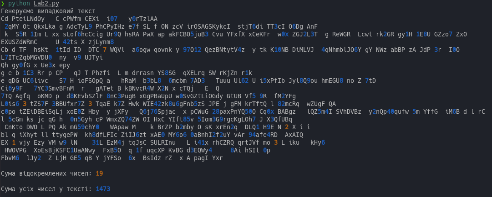

# [Лабораторна робота №1](Lab1/README.md)
## Вертикальне зміщення матриці

# [Лабораторна робота №2](Lab2/README.md)
## Підрахунок чисел у тексті

# [Лабораторна робота №3](Lab3/README.md)
## Підрахунок слів у тексті

